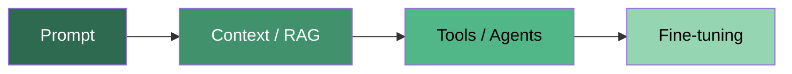
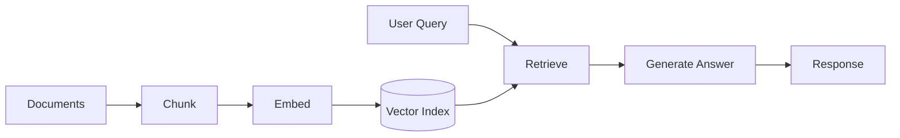
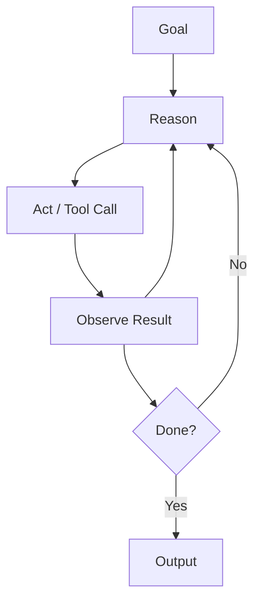

# AI Engineering Roadmap

> A practical path from **"I can write code"** to **"I can build, ship, and maintain real AI products."**

```
  YOU ARE HERE ──► Phase 1 ──► Phase 2 ──► Phase 3 ──► Phase 4
                   Foundations   AI/LLM      Production   Capstone
```

---

## How to read this roadmap

| Principle | What it means |
|-----------|---------------|
| **AI Engineering ≠ ML Engineering** | Build applications *on top of* foundation models — prompt, augment, evaluate, ship. Not training from scratch. |
| **Evaluation is the golden thread** | The skill that separates demos from products. Learn it in Phase 2; apply it from project one. |
| **Learn by building** | Read a topic → ship the smallest thing that uses it. Three projects beat fifty hours of video. |
| **Simplest tool first** | `prompt → context/RAG → tools/agents → fine-tuning` — add complexity only when measurement says you need it. |



**Cost · Latency · Quality** — production work is balancing this triangle.

---

## Phase 1 — Foundations

**Goal:** Write code, talk to APIs, ship something to the internet.

```
┌─────────────────────────────────────────────────────────────┐
│  PHASE 1  ·  Your toolkit                                   │
│  ─────────────────────────────────────────────────────────  │
│  Python · SQL · CLI · Git · APIs · Software basics          │
└─────────────────────────────────────────────────────────────┘
```

### Core skills

- [ ] **Python** — core language, pandas/numpy, async/await, virtual envs, HTTP clients (`requests` / `httpx`)
- [ ] **SQL** — querying, joining, aggregating; feed and inspect AI systems
- [ ] **Command line** — Bash / PowerShell: navigate, script, automate
- [ ] **Git & version control** — branches, commits, pull requests
- [ ] **APIs & HTTP** — REST, JSON, status codes, auth (API keys, OAuth), rate limits, retries, webhooks
- [ ] **Software engineering basics** — deps, env vars/secrets, basic testing, logging, reading docs
- [ ] **Just-enough math** *(optional)* — probability intuition, vectors; enough to understand embeddings & sampling

### Milestone

> Ship one small project that calls an external API and stores or displays the result.

---

## Phase 2 — AI & LLM Foundations

**Goal:** Understand how models work and get reliable, useful output from them.

```
┌─────────────────────────────────────────────────────────────┐
│  PHASE 2  ·  Understand & control the model                 │
│  ─────────────────────────────────────────────────────────  │
│  Models · Tokens · Embeddings · Sampling · Prompts · RAG    │
└─────────────────────────────────────────────────────────────┘
```

### 2.1 How foundation models work

- [ ] **Transformer intuition** — attention, next-token prediction (mental model, not matrix math)
- [ ] **Training pipeline** — pre-training → SFT → alignment (RLHF, DPO, Constitutional AI)
- [ ] **Scale & scaling laws** — data, compute, parameters, emergent abilities
- [ ] **Model landscape** — open-weight vs proprietary, sizes, modalities (text, vision, audio)

### 2.2 Tokenization

- [ ] **Tokens & tokenizers** — subword chunks (BPE); models read tokens, not words
- [ ] **Why it matters** — cost, latency, context limits; budget and debug with token awareness

### 2.3 Embeddings

- [ ] **What embeddings are** — text → vectors that capture meaning
- [ ] **Semantic similarity** — compare vectors to find related content
- [ ] **Why it matters** — foundation of semantic search and RAG *(learn before RAG)*

### 2.4 Sampling & generation

- [ ] **Next-token selection** — probability distribution → sampling decides output
- [ ] **Decoding controls** — temperature, top-k, top-p, frequency/presence penalties, stop sequences
- [ ] **Greedy vs sampling** — determinism vs creativity
- [ ] **Structured / constrained decoding** — force output to match a format

### 2.5 Prompt engineering

- [ ] **Zero-shot vs few-shot** — instruction only vs examples in the prompt
- [ ] **System vs user vs assistant** — rules vs request vs prior turns
- [ ] **Chain-of-thought** — step-by-step reasoning
- [ ] **Prompt chaining & decomposition** — big task → sequence of smaller steps
- [ ] **Defensive prompting** — injection, jailbreaks, hardening
- [ ] **Context length & efficiency** — fit what matters without waste

### 2.6 Structured outputs & function calling

- [ ] **Structured output** — JSON mode, schema enforcement
- [ ] **Function / tool calling** — model chooses functions with structured args *(bridge to agents)*

### 2.7 Context engineering

- [ ] **Context selection** — choose what to include
- [ ] **Ordering & structure** — instructions, examples, retrieved data, question
- [ ] **Context compression** — summarize or distill to save tokens
- [ ] **Retrieval & filtering** — pull only relevant pieces

### 2.8 RAG — Retrieval-Augmented Generation

- [ ] **Why RAG** — ground answers, private/up-to-date data, reduce hallucination
- [ ] **Pipeline** — chunk → embed → index → retrieve → generate
- [ ] **Vector databases** — ANN indexes, storage & search
- [ ] **Retrieval optimization** — hybrid search, reranking, query rewriting, metadata filters
- [ ] **Evaluating RAG** — retrieval quality *and* answer quality, measured separately



### 2.9 Tool use & MCP

- [ ] **Tool integration** — APIs, databases, functions
- [ ] **Structured inputs & outputs** — schema-based, reliable I/O
- [ ] **Action execution** — let the model do things, safely
- [ ] **Multi-step orchestration** — chain tools into coherent workflows
- [ ] **MCP (Model Context Protocol)** — open standard for tools & data sources vs bespoke glue code

### 2.10 Evaluation — the backbone

- [ ] **Why it's hard** — open-ended text has no single correct answer
- [ ] **Methods** — heuristics, similarity, LLM-as-judge, human review
- [ ] **Benchmarks vs your evals** — general model quality vs *your* system works
- [ ] **Golden datasets** — inputs + expected behaviors
- [ ] **Offline vs online** — pre-ship testing vs post-ship monitoring

### Milestone

> Build a RAG prototype with a small eval set. Measure retrieval and answer quality before tuning prompts.

---

## Phase 3 — Production Systems

**Goal:** Turn prototypes into reliable, fast, affordable, and safe products.

```
┌─────────────────────────────────────────────────────────────┐
│  PHASE 3  ·  Ship, scale, optimize, secure                  │
│  ─────────────────────────────────────────────────────────  │
│  Agents · Fine-tuning · Data · Inference · Deploy · Safety  │
└─────────────────────────────────────────────────────────────┘
```

### 3.1 AI agents

- [ ] **Agent loop** — reason → act → observe (ReAct)
- [ ] **Tool use** — APIs, databases, functions
- [ ] **Planning & decomposition** — goal → ordered steps
- [ ] **Memory** — short-term (context) and long-term (persistent stores)
- [ ] **Multi-agent systems** — planner + worker + critic
- [ ] **Frameworks & failure modes** — LangGraph-style orchestration; loops, dead-ends, runaway cost



### 3.2 Fine-tuning

- [ ] **When to fine-tune** — prompt vs RAG vs fine-tune; style/behavior, not usually knowledge
- [ ] **Techniques** — full fine-tune vs PEFT (LoRA / QLoRA)
- [ ] **Memory bottleneck** — GPU memory, quantization
- [ ] **Instruction & preference tuning** — SFT, DPO

### 3.3 Dataset engineering

- [ ] **Data curation** — high-quality, relevant selection
- [ ] **Data augmentation** — transform existing examples
- [ ] **Data synthesis** — model-generated data when real data is scarce
- [ ] **Data processing** — clean, dedupe, filter, format
- [ ] **Data quality & evaluation** — verify the dataset helps before training

### 3.4 Inference optimization

- [ ] **Metrics** — latency, throughput, TTFT, tokens/sec, cost per token
- [ ] **AI accelerators** — GPUs, TPUs; memory bandwidth vs raw compute
- [ ] **Model optimization** — quantization, distillation, pruning
- [ ] **Serving** — batching, KV caching, speculative decoding

### 3.5 Deployment & cost

- [ ] **Serving patterns** — model APIs, gateways, routing
- [ ] **Caching** — prompt caching, semantic caching
- [ ] **Streaming** — token-by-token UX
- [ ] **Cost management** — monitor spend; price / quality / latency trade-offs

### 3.6 Observability & monitoring

- [ ] **Logging & tracing** — every request, every step in multi-step systems
- [ ] **Quality & drift** — catch degradation over time
- [ ] **User feedback loops** — thumbs, corrections → evals & improvements
- [ ] **A/B testing** — compare prompts, models, pipelines on real traffic

### 3.7 Safety, security & guardrails

- [ ] **Input/output guardrails** — validate and filter
- [ ] **Prompt-injection defense** — adversarial inputs
- [ ] **Sensitive data** — PII detection, redaction, privacy
- [ ] **Content moderation** — harmful / off-policy content
- [ ] **Responsible AI** — fairness, transparency, accountability

### Milestone

> Ship one agent or productionized RAG system with logging, evals, and a cost dashboard.

---

## Phase 4 — Capstone

**Goal:** Prove you can run the full loop end to end.

```
┌─────────────────────────────────────────────────────────────┐
│  PHASE 4  ·  Bring it all together                          │
│  ─────────────────────────────────────────────────────────  │
│  Build · Measure · Ship · Iterate                           │
└─────────────────────────────────────────────────────────────┘
```

### Project ideas

| # | Project | Muscles exercised |
|---|---------|-------------------|
| 1 | **RAG assistant** over a real document set | chunking, retrieval, reranking, retrieval + answer evals |
| 2 | **Tool-using agent** for a multi-step task | planning, ReAct loop, MCP/tools, failure handling |
| 3 | **Fine-tuned small model** for a narrow job | dataset engineering, PEFT, inference optimization |

### Capstone checklist

- [ ] Evaluation and monitoring wired in from day one
- [ ] Real users or realistic traffic (even if small)
- [ ] Documented cost, latency, and quality baselines
- [ ] Iterate: ship → measure → find failures → fix → repeat

---

## Decision guide

When stuck, ask in order:

```
1. Can a better prompt fix this?
2. Can better context / RAG fix this?
3. Do I need tools or an agent?
4. Do I need fine-tuning?
```

| Problem type | Start with |
|--------------|------------|
| Wrong format / tone | Prompt → structured output → fine-tune |
| Missing knowledge | RAG → better retrieval → fine-tune (rare) |
| Multi-step actions | Function calling → agent loop |
| Too slow / expensive | Inference optimization → caching → smaller model |
| Can't measure quality | Build evals first — always |

---

## Key resources

| Resource | Why |
|----------|-----|
| [**AI Engineering** — Chip Huyen](https://www.oreilly.com/library/view/ai-engineering/9781098166298/) | Best single book; this roadmap maps closely to its structure |
| **Provider docs** (Anthropic, OpenAI, etc.) | Authoritative, up-to-date: prompting, tools, structured outputs, pricing |
| **Hands-on practice** | The real curriculum — build, measure, iterate |

---

## Progress tracker

| Phase | Status | Target date | Notes |
|-------|--------|-------------|-------|
| Phase 1 — Foundations | ⬜ Not started | | |
| Phase 2 — AI & LLM Foundations | ⬜ Not started | | |
| Phase 3 — Production Systems | ⬜ Not started | | |
| Phase 4 — Capstone | ⬜ Not started | | |

*Update status: ⬜ Not started · 🟡 In progress · ✅ Complete*

---

*Last updated: June 2026*
