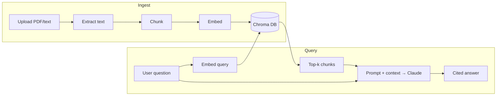

# Talk to Documents — RAG Assistant

Upload PDFs or text files and ask questions in natural language. The app retrieves the most relevant passages from your documents and answers with **citations** — powered by Retrieval-Augmented Generation (RAG).

Part of the [AI Engineering Roadmap](https://github.com/waqas-rashid1/ai-engineering-roadmap).

## Architecture



## Stack

| Component | Role |
|-----------|------|
| **Claude** (Anthropic API) | Answer generation with grounding + citations |
| **sentence-transformers** (`all-MiniLM-L6-v2`) | Local embeddings (free, runs on your machine) |
| **Chroma** | Vector database — stores and searches chunk embeddings |
| **Streamlit** | Web UI — upload, chat, sources panel |
| **pypdf** | PDF text extraction |

## Project structure

```
rag-assistant/
├── app.py              # Streamlit UI (main entry point)
├── ingest.py           # Load → chunk → embed → store
├── rag.py              # Retrieve → generate (RAG core)
├── evaluate.py         # Golden tests + metrics
├── demo_memory.py      # Multi-turn chat demo (CLI)
├── embeddings_demo.py  # Embedding similarity demo
├── test_key.py         # API key smoke test
├── activate.sh         # Activate ~/.venvs/rag-assistant
├── docs/sample.txt     # Sample document for testing
├── chroma_db/          # Vector store (auto-created, gitignored)
├── .env.example        # API key template
└── requirements.txt
```

## Setup

### 1. Virtual environment

We use `~/.venvs/rag-assistant` (not inside this folder — slow on some drives):

```bash
cd rag-assistant
python3.11 -m venv ~/.venvs/rag-assistant
source activate.sh
```

### 2. Dependencies

```bash
pip install torch --index-url https://download.pytorch.org/whl/cpu
pip install -r requirements.txt
```

### 3. API key

```bash
cp .env.example .env
# Edit .env → ANTHROPIC_API_KEY=sk-ant-...
```

Get a key at [console.anthropic.com](https://console.anthropic.com).

### 4. Verify

```bash
python test_key.py    # should print a short reply from Claude
python ingest.py      # indexes docs/sample.txt into chroma_db/
```

## Run the app

```bash
source activate.sh
streamlit run app.py
```

Open the URL shown (usually `http://localhost:8501`).

1. **Sidebar** — upload PDF / `.txt` / `.md` → click **Index documents**
2. **Chat** — ask a question about your documents
3. **Sources** — expand to see retrieved chunks
4. **Follow-up** — ask "what does the third stage do?" — memory carries prior turns

## How it works

1. **Load** — PDFs and text files are extracted to plain text with source metadata (filename, page).
2. **Chunk** — long text is split into overlapping pieces (~800 chars, 150 overlap).
3. **Embed** — each chunk is turned into a 384-number vector (semantic meaning).
4. **Store** — vectors + text live in Chroma (`chroma_db/` on disk).
5. **Retrieve** — your question is embedded; top-k similar chunks are fetched.
6. **Generate** — Claude gets numbered passages + rules (cite `[n]`, refuse if not in context).
7. **Memory** — prior chat turns are resent each call so follow-ups work.

## Evaluation

Measure quality with numbers, not vibes:

```bash
python ingest.py          # ensure sample.txt is indexed
python evaluate.py        # retrieval hit rate + keyword match
python evaluate.py --judge   # + LLM-as-judge (extra API calls)
```

Example output:

```
Retrieval hit rate:   4/4  (100%)
Answer keyword match: 4/4  (100%)
```

Tune `chunk_size`, `overlap`, or `k` in `ingest.py` / `rag.py`, re-index, re-run — watch metrics change.

## CLI demos (learning path)

Built step-by-step; each file maps to one roadmap concept:

| Command | Step | Teaches |
|---------|------|---------|
| `python test_key.py` | 0 | API + env vars |
| `python ingest.py` | 1–3 | Load, chunk, embed, Chroma |
| `python embeddings_demo.py` | 3 | Semantic similarity |
| `python rag.py` | 4–5 | Retrieve + cited answers |
| `python demo_memory.py` | 6 | Multi-turn history |
| `streamlit run app.py` | 7 | Full UI |
| `python evaluate.py` | 8 | Retrieval + answer metrics |

## Limitations

- **No OCR** — scanned PDFs (image-only) return empty text; use text-based PDFs or `.txt`.
- **Single collection** — all documents share one Chroma collection.
- **Local embeddings** — good for learning; production often uses Voyage/OpenAI embeddings.
- **No reranking** — top-k vector search only (no hybrid keyword + rerank).
- **Chat memory** — lives in server RAM (`st.session_state`); gone when Streamlit stops.
- **Indexed docs persist** — `chroma_db/` survives restarts; delete the folder to reset.

## Next steps (upgrades)

- [ ] Add **reranking** and **hybrid search** (keyword + vector)
- [ ] Swap embeddings for **Voyage AI** or **OpenAI** — compare on `evaluate.py`
- [ ] **Deploy** to [Streamlit Community Cloud](https://streamlit.io/cloud)
- [ ] **Prompt caching** for repeated context (lower cost/latency)
- [ ] **Observability** — log each query, chunks retrieved, and answer
- [ ] Add a **demo GIF** below (record: upload → index → question → follow-up)

## Demo

<!-- Replace with your screen recording GIF when ready -->
Record a 30–60s clip: upload a document → index → ask a question → show Sources → ask a follow-up. Save as `docs/demo.gif` and uncomment:

<!--  -->

## License

MIT — use freely for learning and portfolio projects.
